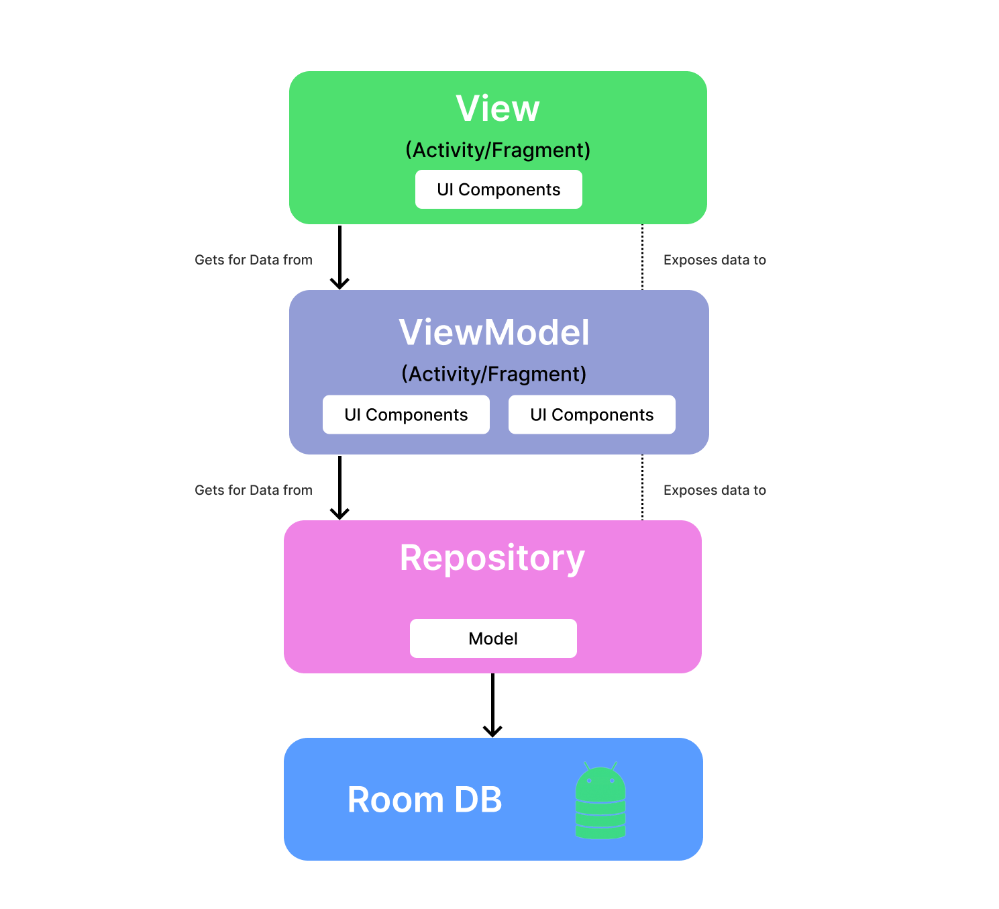

# OverView and Features 📰
* Kotlin based application that fetch news from api and show it in a list.  

# Feature Implemented
* Click the news to read full article  
* Search article by their title name  
* Save article using boomark button and show it in bookmark activity  
* Room Database for reading the article even without internet  
* Sort/UnSort the articles by date of pubhlishing them  

# TestCases
* [TestCase](https://docs.google.com/spreadsheets/d/1xYkA95dw9zW9GENRrc5w7KKHE4BKUS3EO1VhgHFRLHA/edit?usp=sharing) - Test cases are the sequence of actions or circumstances that are devised to confirm the effectiveness of a software program or application

# ScreenShots

<table align="center">
  <tr>
    <td></td>
    <td></td>
    <td></td>
    <td></td>
  </tr>
</table> 

# Built with 🛠

- [Kotlin](https://kotlinlang.org/) - First class and official programming language for Android development.
- [Coroutines](https://kotlinlang.org/docs/reference/coroutines-overview.html) - For asynchronous calls and tasks to utilize threads.
- [Android Architecture Components](https://developer.android.com/topic/libraries/architecture) - Collection of libraries that help you design robust, testable, and maintainable apps.
  - [LiveData](https://developer.android.com/topic/libraries/architecture/livedata) - Data objects that notify views when the underlying database changes.
  - [ViewModel](https://developer.android.com/topic/libraries/architecture/viewmodel) - Stores UI-related data that isn't destroyed on UI changes.
  - [Room](https://developer.android.com/topic/libraries/architecture/room) - Room is an Android library which is an ORM that wraps Android's native SQLite database.
  - [StateFlow and SharedFlow](https://developer.android.com/kotlin/flow/stateflow-and-sharedflow#:~:text=StateFlow%20is%20a%20state%2Dholder,property%20of%20the%20MutableStateFlow%20class.) - StateFlow and SharedFlow are Flow APIs that enable flows to optimally emit state updates and emit values to multiple consumers.
  - Third party libraries like [Retrofit](https://square.github.io/retrofit/), [Glide](https://bumptech.github.io/glide/int/volley.html).

# Architecture 👷‍♂️
This app uses [MVVM(Model View View-Model)](https://developer.android.com/topic/architecture#recommended-app-arch) architecture.

 * Third party libraries like [Retrofit](https://square.github.io/retrofit/), [Glide](https://bumptech.github.io/glide/int/volley.html).
 
 # Why Retrofit?
 * Retrofit is type-safe REST client for Android and Java which aims to make it easier to consume RESTful web services.
 
 # What is Room?
 * Room is an ORM, Object Relational Mapping library. In other words, Room will map our database objects to Java objects. Room provides an abstraction layer over SQLite to allow fluent database access while harnessing the full power of SQLite.
